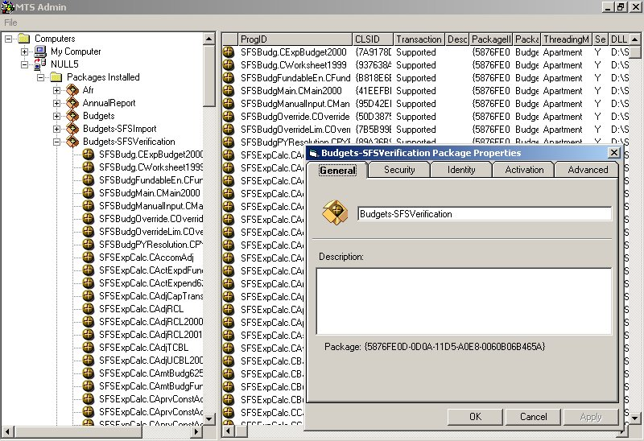



## MTS Admin

### Description

The purpose of this code is to remotely administer an MTS COM/COM+ packages from any platform (windows 9x, Win2000, etc . . .) that supports DCOM. It contains the ability to add/remove packages and components, administer packages security, change package and component properties and most other routine operations required to administer an MTS machine. It does this by using a server side DLL and client side application, eliminating issues that arrise with the differences between COM+ and NT4.0 MTS. Please note that roles cannot be administered with this version.

Update #1--Fixed bug in client that didn't properly map the filename to a UNC when adding a new component. Also fixed a bug that occured when multiple computers had the same components installed resulting in duplicate keys in the treeview.
 
### More Info
 
See the code.

             |
---                |---
**Submitted On**   |2002-08-04 20:27:06
**By**             |[Robert May](https://github.com/Planet-Source-Code/PSCIndex/blob/master/ByAuthor/robert-may.md)
**Level**          |Advanced
**User Rating**    |5.0 (20 globes from 4 users)
**Compatibility**  |VB 5\.0, VB 6\.0
**Category**       |[OLE/ COM/ DCOM/ Active\-X](https://github.com/Planet-Source-Code/PSCIndex/blob/master/ByCategory/ole-com-dcom-active-x__1-29.md)
**World**          |[Visual Basic](https://github.com/Planet-Source-Code/PSCIndex/blob/master/ByWorld/visual-basic.md)
**Archive File**   |[MTS Admin24301882001\.zip](https://github.com/Planet-Source-Code/robert-may-mts-admin__1-25962/archive/master.zip)

### API Declarations

Lots of Registry API's

